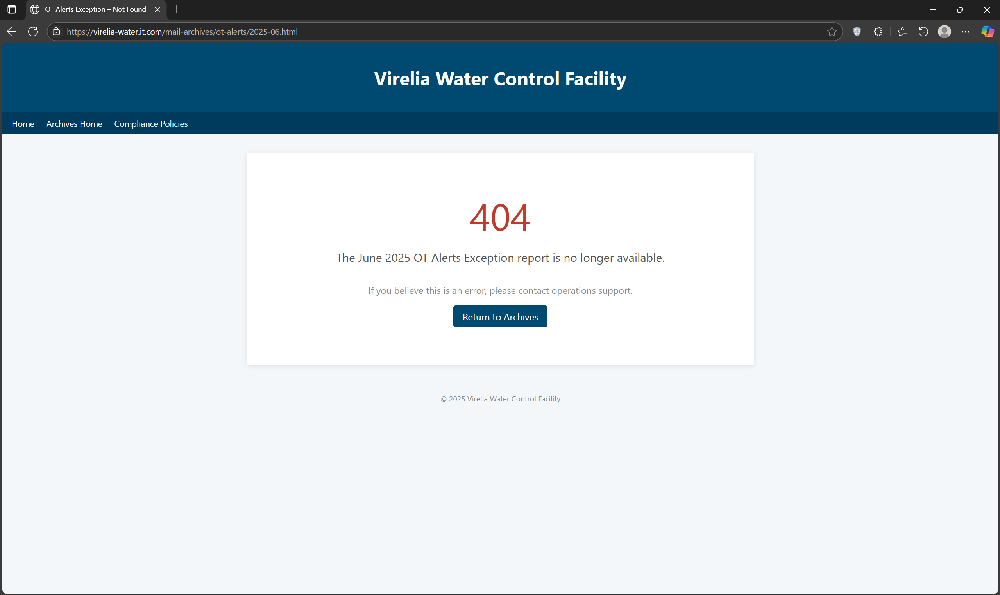

# OSINT 1

***Hexline, we need your help investigating the phishing attack from 3 months ago. We believe the threat actor managed to hijack our domain virelia-water.it.com and used it to host some of their infrastructure at the time. Use your OSINT skills to find information about the infrastructure they used during their campaign.***

First, let's start by analyzing the domain virelia-water.it.com

I didn’t find anything interesting here, so I decided to check the domain’s SSL certificates on crt.sh. It’s a handy site for looking up public Certificate Transparency logs.

By querying crt.sh for virelia-water.it.com, I aimed to identify any suspicious or previously active subdomains that might have been used by the threat actor during their phishing campaign.

During the investigation, I identified a suspicious subdomain 54484d7b5375357373737d.virelia-water.it.com that appears to be formatted like a hexadecimal string

I used CyberChef’s “From Hex” tool to decode the suspicious hex-looking subdomain.

Decoding the hex string in CyberChef revealed the flag: THM{Su5sss}
