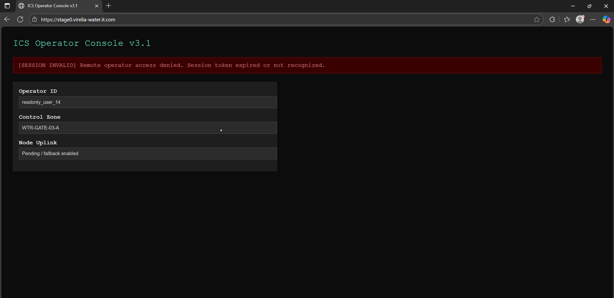
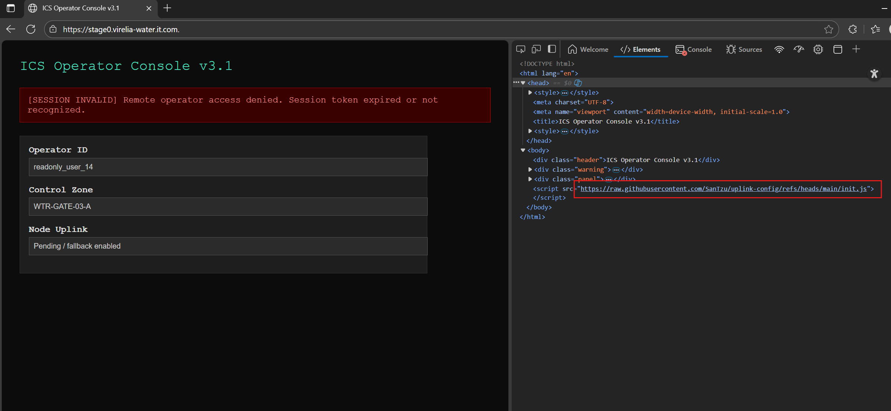
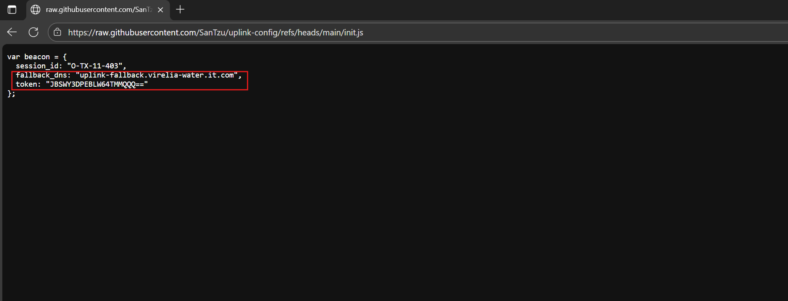
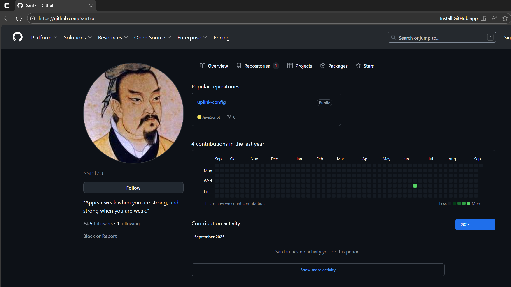
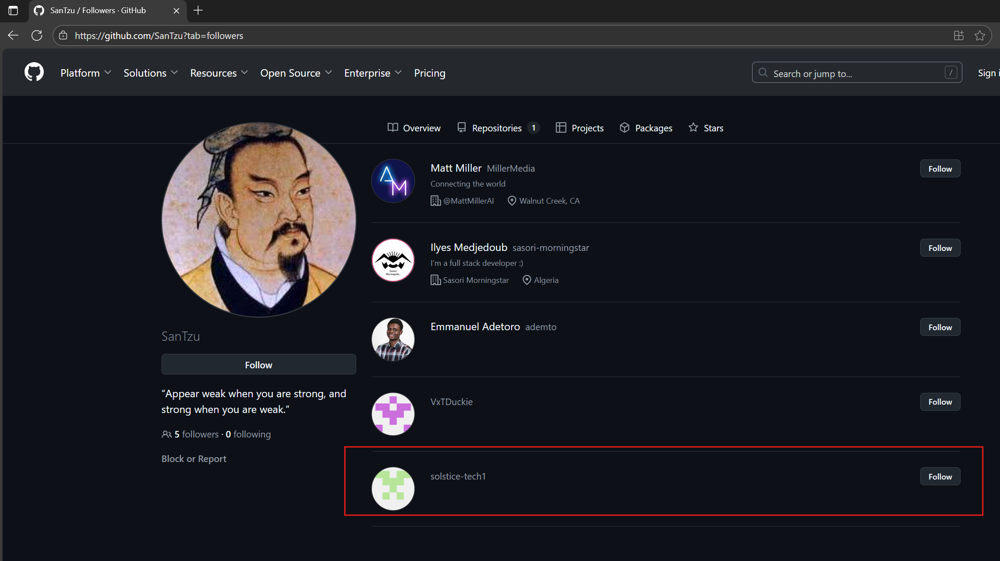
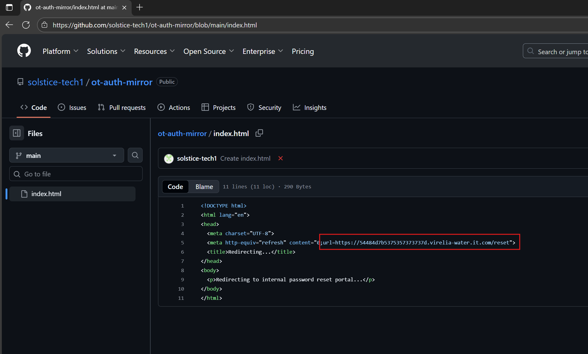
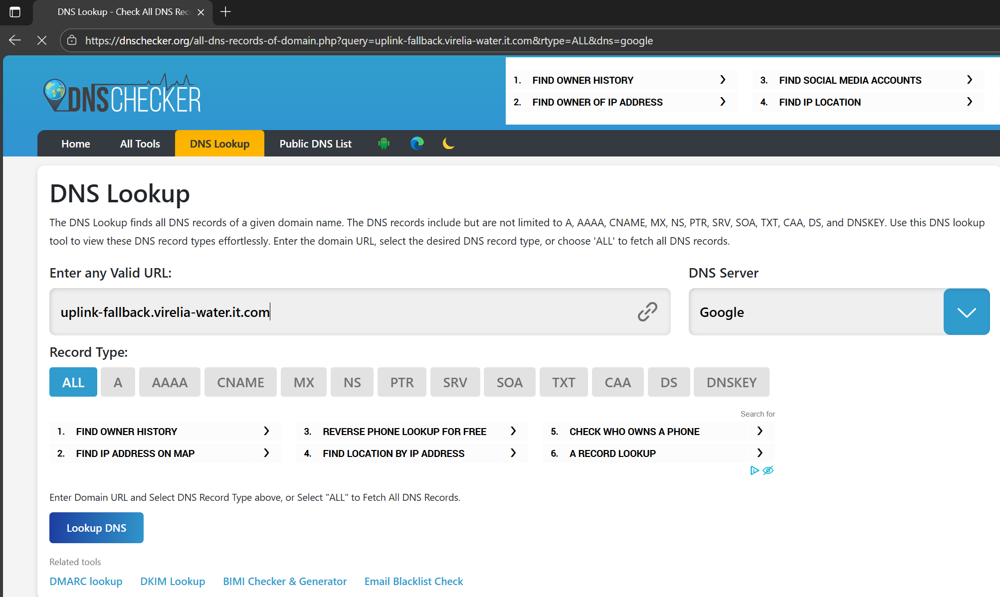
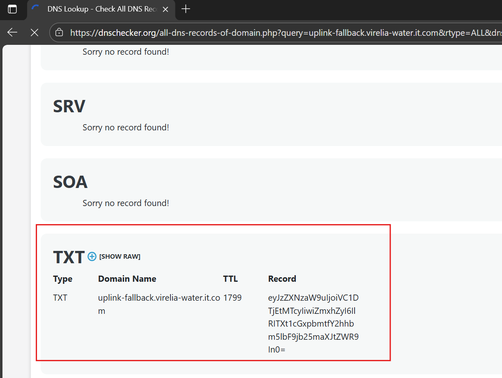
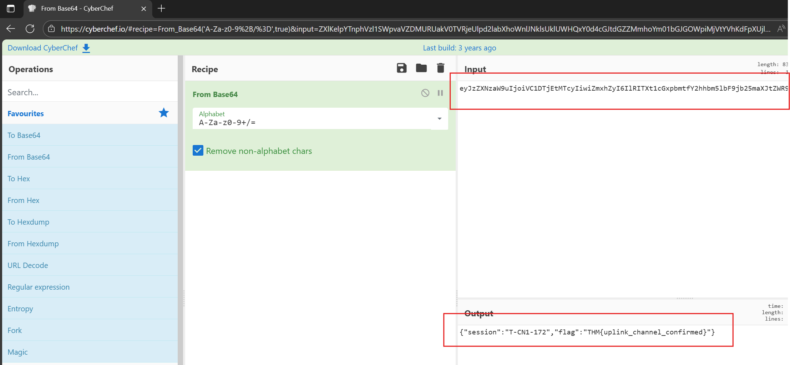

# OSINT 2

***Great work on uncovering that suspicious subdomain, Hexline. However, your work here isn’t done yet, we believe there is more.***

Your work here isn’t done yet — we believe there is more. In fact, there is additional information that needs to be investigated regarding the domain. In our results from crt.sh, another subdomain was listed: stage0.virelia-water.it.com.

Based on crt.sh from OSINT 1, there is still one subdomain that we have not analyzed yet: stage0.virelia-water.it.com.

This URL had an “ICS Operator Console” and a script at the end of the source code references an init.js file hosted on GitHub. https://raw.githubusercontent.com/SanTzu/uplink-config/refs/heads/main/init.js, which had this content:

Analysis of the file revealed a previously unknown subdomain: uplink-fallback.virelia-water.it.com

The GitHub user's profile was reviewed, but it did not provide any information relevant to the investigation.

Finding nothing useful in his profile, I moved on to check out his followers to see if they might reveal anything.

One of them, https://github.com/solstice-tech1
, was found to link to another repository here: https://github.com/solstice-tech1/ot-auth-mirror/blob/main/index.html
, which contains the URL https://54484d7b5375357373737d.virelia-water.it.com/reset
. However, this had already been discovered in OSINT 1, so it holds no additional significance.

Returning to the subdomain uplink-fallback.virelia-water.it.com, I was unable to access it, so I redirected my queries to gather information. I used the website dnschecker.org, which allows me to search all DNS records at once. The Dig tool will also be useful for querying information.

From there, we can find a TXT record for the subdomain, which appears to be a Base64 string.
Pasting this string into CyberChef will reveal the second flag.

The flag: THM{uplink_channel_confirmed}
